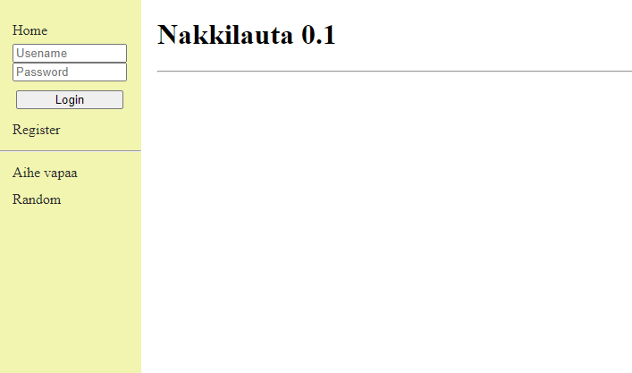

# Simple flask message board

Simple message board app resemblign chan style mssage boards made in Python using Flask framework.  
Usable demo is available at https://nakkilauta.malasip.dev   
Software is still in pretty much alpha stage with many of the intended functionalities missing.   
Basic functionality like creating, editing and deleting posts and threads work. Basic user management and administrative tools are also included.

Documentation and sources used for project:  
* https://jinja.palletsprojects.com/en/2.11.x/api/
* https://terokarvinen.com//2016/flask-templates/index.html
* https://flask-sqlalchemy.palletsprojects.com/en/2.x/
* https://developer.mozilla.org/en-US/docs/Web/CSS/:target
* https://wtforms.readthedocs.io/en/stable/fields/#wtforms.fields.SelectField
* https://cdnjs.cloudflare.com/ajax/libs/font-awesome/4.7.0/css/font-awesome.min.css

